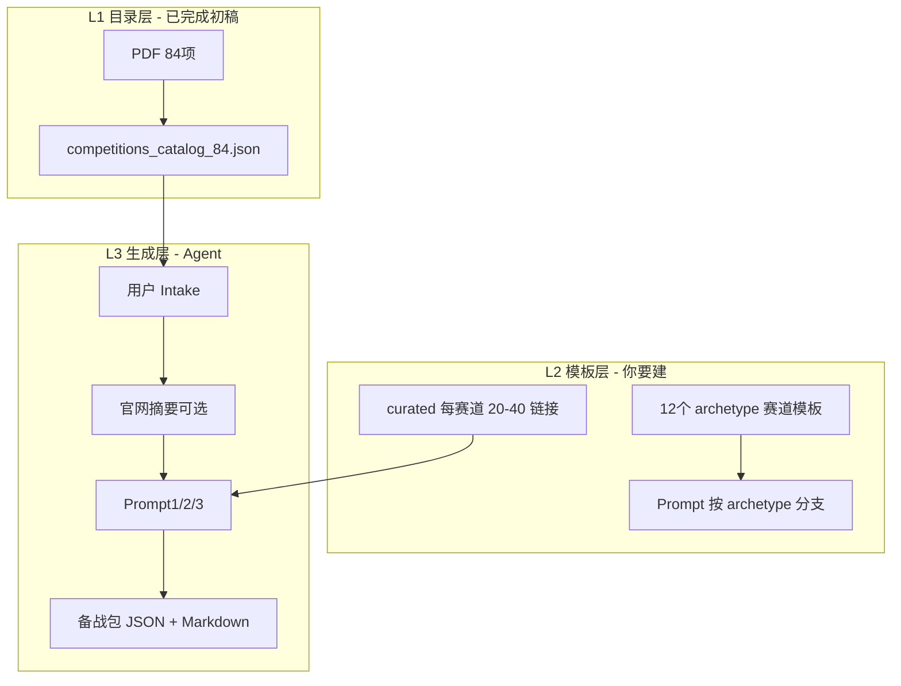

# 如何开始：84 项教育部认可竞赛 · 备战规划 Agent


## 1. 产品架构（三层）



| 层级 | 内容 | 你的工作量 |
|------|------|------------|
| **L1** | 84 项 id / name / official_url | 已脚本化，抽检即可 |
| **L2** | ~12 种 `archetype` 模板 + 每类 curated 资料 | 2～3 周，核心 PM 资产 |
| **L3** | 选中比赛 → 调用 LLM 流水线 | 1～2 周 vibe coding |

---

## 2. 搭建步骤

### Step 1.1 环境

```powershell
cd c:\Users\JimiM\Desktop\grade_first\agent
python -m venv .venv
.\.venv\Scripts\Activate.ps1
pip install -r requirements.txt
cd frontend && npm install
```

### Step 1.2 确认 84 项目录

```powershell
python scripts/extract_catalog_from_pdf.py
python scripts/assign_archetypes.py
```

打开 `data/competitions_catalog_84.json`，人工检查：

- [ ] 是否正好 84 条  
- [ ] `official_url` 为空的项（补链接，如第 72、74 项等）  
- [ ] `archetype` 是否合理（脚本仅为初稿）

### Step 1.3 定「成功定义」

| 阶段 | 成功标准 |
|------|----------|
| **MVP（第 3 周）** | 下拉选 84 项之一 → 60 秒内出备战包 Markdown |
| **Beta（第 6 周）** | 84 项均能生成；抽检 20 项 4 分+ 有用率 ≥60% |
| **作品集（第 8 周）** | 5 个热门赛深度打磨 + 评测报告 |

---

## 3. 十二种赛道模板（archetype）

已为 84 项自动打了初稿标签（`assign_archetypes.py`），你需要为每种 archetype 各写一份：

1. `archetype` 说明（适合谁、典型提交物）  
2. 默认 `required_skills`（5～8 个）  
3. 默认 4～6 阶段 `prep_plan` 骨架  
4. `curated_resources_{archetype}.csv`（20～40 条**通用**资料）  
5. `submission_checklist` 模板  

| archetype | 覆盖示例 |
|-----------|----------|
| `innovation_entrepreneurship` | 互联网+、挑战杯、iCAN、服创 |
| `algorithm_programming` | ACM、蓝桥杯、百度之星、软件杯 |
| `math_modeling` | 数学建模、统计建模 |
| `robotics_engineering` | 机器人、智能汽车、西门子杯 |
| `electronics_embedded` | 电子设计、嵌入式、集创、光电 |
| `mechanical_structure` | 机械、结构、成图、三维数字化 |
| `computer_software` | 计算机设计、计算机大赛、信息安全 |
| `ai_data` | 全球校园 AI 算法赛 |
| `design_creative` | 广告、华灿、米兰、数字艺术 |
| `business_simulation` | 三创、商业精英、沙盘、市场调查 |
| `language_humanities` | 外研社、英语演讲、经典诵读 |
| `medical_life` / `physics_chemistry` / `general_stem` | 医学、物化、其他工科 |

**生成逻辑**：用户选「全国大学生数学建模竞赛」→ 读取 `id=5, archetype=math_modeling` → 用数学建模模板 + 该赛官网 URL 做 Prompt1 增强。

---

## 4. 分阶段实施路线图（8 周）

### 第 1 周：目录产品化

| 天 | 任务 | 产出 |
|----|------|------|
| 1-2 | 校验 JSON、补全空 URL | `competitions_catalog_84.json` v1 |
| 3 | 人工修正 archetype（Excel 导出改再合并） | 84 项 archetype 定稿 |
| 4-5 | Vue：搜索 + 表格选择比赛 | `frontend/src/views/CompetitionsView.vue` |
| 6-7 | 展示：名称、官网、archetype、一键「生成备战包」占位 | 可演示选赛 |

### 第 2 周：先做 1 个 archetype 端到端

建议从 **`math_modeling`** 或 **`algorithm_programming`** 开始（资料多、边界清晰）。

- 完成 `data/curated/math_modeling.csv`  
- 跑通 `docs/competition-prep-prompts.md` 的 Prompt 1→2→3  
- 用「数学建模竞赛」试跑并导出 MD  

### 第 3 周：MVP — 84 项都能「出结果」

- 12 个 archetype 各有一份 **最小** curated（每份至少 10 条）  
- Prompt 增加变量：`{{competition_from_catalog}}` `{{archetype}}`  
- **不要求**每项定制，只要求选任意一项都能生成  

### 第 4～5 周：质量提升

- 官网抓取：`httpx` + `trafilatura` 提取正文 → 填入 `rules_text`  
- 防幻觉：无 URL 的资料 `verified=false`  
- 论文：arXiv 仅 AI/算法/建模类 archetype 开启  

### 第 6 周：深度打磨 5 个热门赛

建议：互联网+、挑战杯、数学建模、ACM/蓝桥杯、电子设计  

每项额外维护：`competition_overrides/{id}.yaml`（赛项特例、往年时间、子赛道）

### 第 7～8 周：评测与作品集

- 20 项 × 人工评分表  
- 10 人试用问卷  
- 3 分钟演示录屏 + 简历 bullet  

---

## 5. 数据模型（在原有 Schema 上扩展）

### 5.1 目录项 `competitions_catalog_84.json`

```json
{
  "id": 5,
  "name": "全国大学生数学建模竞赛",
  "official_url": "http://www.mcm.edu.cn/",
  "archetype": "math_modeling",
  "aliases": ["国赛数模", "CUMCM"],
  "typical_registration": "7-9月",
  "typical_final": "11月",
  "override_id": null
}
```

（`typical_*` 可从高顿等公开表手工补，非必须。）

### 5.2 覆盖配置 `data/overrides/5.yaml`（深度赛例）

```yaml
competition_id: 5
extra_rules_text: ""
must_read_resources:
  - title: 全国大学生数学建模竞赛官网
    url: http://www.mcm.edu.cn/
common_pitfalls:
  - 论文格式与摘要页易出错
paper_search_keywords: ["mathematical modeling competition", "optimization"]
```

### 5.3 用户 Intake（生成时）

| 字段 | 说明 |
|------|------|
| `competition_id` | 1-84，从目录选择 |
| `deadline` | 用户自己的备赛截止日 |
| `weekly_hours` | 5-40 |
| `skill_level` | beginner / intermediate / experienced |
| `track` | 子赛道（可选） |
| `goal` | 校奖 / 省奖 / 完赛 |

---

## 6. Agent 流水线（针对 84 项）

```
用户选择 competition_id
  → 加载 catalog[name, url, archetype]
  → 加载 archetype 模板 + curated_{archetype}.csv
  → 若有 overrides/{id}.yaml 则合并
  → [可选] GET official_url → rules_text
  → Prompt1 赛题解析（注入：名称+官网摘要+模板默认技能）
  → Prompt2 路径（注入：deadline, weekly_hours）
  → arXiv（按 archetype 开关）
  → Prompt3 资料合并
  → 保存 SQLite + 导出 Markdown
```

**关键 Prompt 增补**（加入 Prompt1 System）：

```text
本项目针对「教育部认可的全国大学生学科竞赛名录」中的具体赛项。
赛项名称与官网以 catalog 为准，不得改名。
若官网摘要为空，仅基于 archetype 模板生成通用备战建议，并在 warnings 中说明。
```

---

## 7. Vibe coding 顺序（给 Cursor 的任务清单）

按顺序复制给 Cursor，**不要一次让它写完整个系统**：

1. **任务 A**：读取 `competitions_catalog_84.json`，Vue 搜索 + 表格选赛，展示 name/url/archetype。  
2. **任务 B**：SQLite 表 `prep_plans`，字段存完整 JSON。  
3. **任务 C**：实现 `load_archetype_curated(archetype)` 读 CSV。  
4. **任务 D**：按 `competition-prep-prompts.md` 实现 `run_pipeline(competition_id, intake)`。  
5. **任务 E**：`export_markdown(plan)` 下载按钮。  
6. **任务 F**：`fetch_official_summary(url)` 超时 10s，失败则跳过。  

环境变量：`.env` 中 `LLM_API_KEY`、`LLM_BASE_URL`、`LLM_MODEL`。

---

## 8. 84 项资料的维护策略（可完成）

| 策略 | 数量 | 说明 |
|------|------|------|
| **A. 赛道通用资料** | 12 × 20 = 240 条 | 覆盖全部 84 项的 80% 需求 |
| **B. 赛项 override** | 5～10 项 | 面试时重点讲深 |
| **C. 官网实时摘要** | 84 项 | 自动生成，不保证完整 |
| **D. 论文推荐** | 仅 6 个 archetype | 算法/AI/建模/机器人/信安/计算机 |

每周维护节奏：

- 第 1 周：完成 2 个 archetype 的 curated  
- 第 2～3 周：每周 +3 个 archetype  
- 第 4 周起：只维护 override 和用户反馈 Bad Case  

---

## 9. 合规与免责

- 目录 PDF 注明来源高教学会分析报告；产品页写：**「名录仅供参考，以主办方最新通知为准」**。  
- 不批量爬取官网；仅用户发起时对**单个 URL** 抓取摘要。  
- 不存储需登录的付费资料全文。

---

## 10. 自检清单（上线前）

- [ ] 84 项均可从 UI 选中  
- [ ] 任意选 10 项能在 90s 内出 Markdown  
- [ ] 抽检 30 条推荐链接，胡编率 &lt;5%  
- [ ] 空 `official_url` 的项已补或 UI 提示用户粘贴章程  
- [ ] 12 个 archetype 均有 curated CSV  
- [ ] 5 个 override 赛有独立评测记录  

---

## 11. 本仓库已有文件

| 路径 | 用途 |
|------|------|
| `data/competitions_catalog_84.json` | 解析后的 84 项 |
| `data/README.md` | PDF 等本地数据说明（PDF **不提交** GitHub） |
| `data/competition-catalog-2025.pdf` | 原始 PDF（**仅本地**，见 `data/README.md`） |
| `scripts/extract_catalog_from_pdf.py` | 重新解析 PDF |
| `scripts/assign_archetypes.py` | 批量打 archetype 标签 |
| `docs/competition-prep-agent-PRD.md` | 产品 PRD |
| `docs/competition-prep-prompts.md` | Prompt 1/2/3 |
| `docs/competition-prep-output-schema.json` | 输出 JSON 结构 |

---

## 12. 你明天开始的 3 件事

1. 打开 `competitions_catalog_84.json`，用 30 分钟补全**空链接**、改掉明显错误的 archetype。  
2. 选 **数学建模（id=5）** 或 **蓝桥杯（id=27）**，手工写一版「理想备战包」当 Gold Sample。  
3. 让 Cursor 只做 **任务 A（选赛 UI）**，跑通后再做 Agent 流水线。

完成以上，你就从「想法」进入「84 项目录驱动的 Agent 产品」了。
