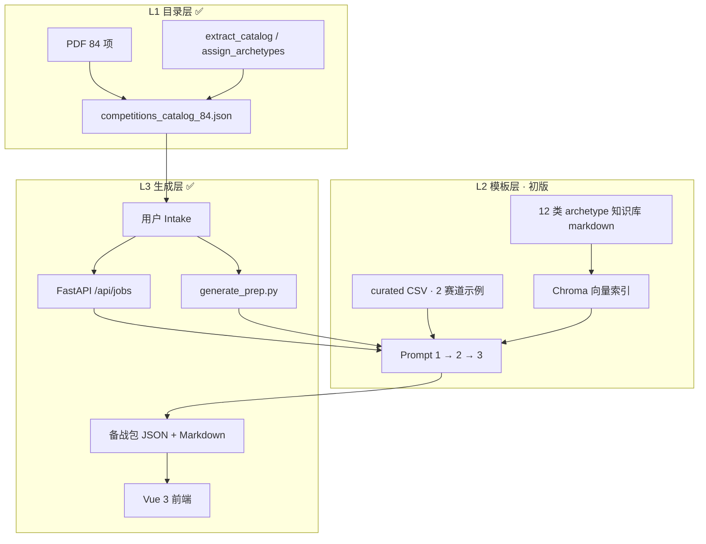

# 第一版发布说明（v1.0）

> **教育部 84 项学科竞赛 · 备战规划 Agent**  
> 记录首个可端到端使用的产品版本：目录 + RAG + LLM 生成流水线 + Web 界面。

---

## 1. 版本定位

| 项 | 说明 |
|----|------|
| **目标用户** | 准备参加学科竞赛的大学生（入门～有基础） |
| **核心价值** | 从 84 项认定竞赛中选一项 → 填写备赛约束 → 生成可执行的备战包（路径 + 资料 + Checklist） |
| **交付形态** | CLI 脚本 + 浏览器 Web 产品（Vue 前端 + FastAPI 后端） |
| **MVP 标准** | 下拉/搜索选择竞赛 → 异步生成 → 页面查看并导出 Markdown / JSON |

---

## 2. 三层架构完成情况



| 层级 | 内容 | v1.0 状态 |
|------|------|-----------|
| **L1** | 84 项 `id` / `name` / `official_url` / `archetype` | ✅ 已脚本化入库 |
| **L2** | 12 种 archetype 知识模板 + curated 资料 + RAG | ⚠️ 知识库骨架齐全；curated 仅 2 赛道有示例 CSV |
| **L3** | Intake → LLM 流水线 → 备战包输出 | ✅ CLI + Web API 均已打通 |

---

## 3. 功能清单

### 3.1 数据与脚本

| 模块 | 路径 | 说明 |
|------|------|------|
| 竞赛目录 | `data/competitions_catalog_84.json` | 84 项结构化名录 |
| 目录抽取 | `scripts/extract_catalog_from_pdf.py` | 从官方 PDF 解析名录（PDF 本地放置，不入库） |
| 赛道标注 | `scripts/assign_archetypes.py` | 为每项自动打 `archetype` 初稿标签 |
| Curated 示例 | `data/curated/math_modeling.csv` | 数学建模赛道推荐资料 |
| Curated 示例 | `data/curated/algorithm_programming.csv` | 算法编程赛道推荐资料 |
| 示例模板 | `data/curated_resources.example.csv` | curated CSV 字段说明 |

### 3.2 RAG 检索增强

| 模块 | 路径 | 说明 |
|------|------|------|
| 知识库 | `knowledge/archetype_*` | 12 类赛道基础知识 markdown |
| 比赛覆盖 | `knowledge/overrides/competition_05`、`competition_27` | 数学建模、蓝桥杯等深度覆盖示例 |
| 索引构建 | `scripts/build_rag_index.py` | 写入本地 Chroma（`data/chroma/`，已 gitignore） |
| 检索调试 | `scripts/query_rag.py` | 命令行验证检索效果 |
| 流水线挂钩 | `rag/pipeline_hook.py` | 为 Prompt 1/2/3 注入 `rag_context` |

设计说明见 [RAG_DESIGN.md](./RAG_DESIGN.md)。

### 3.3 备战包生成（L3 核心）

| 模块 | 路径 | 说明 |
|------|------|------|
| 生成脚本 | `scripts/generate_prep.py` | Prompt 1→2→3：赛题解析 → 分阶段路径 → 资料与 Checklist |
| 输出目录 | `output/prep_{id}.md` / `.json` | CLI 默认输出（已 gitignore） |
| LLM | `.env` 中 `LLM_API_KEY` 等 | 对接 DeepSeek（OpenAI 兼容接口） |

**Prompt 阶段概览：**

1. **Prompt 1** — 赛题解析：赛制、评分、提交物、能力项、常见坑  
2. **Prompt 2** — 分阶段路径：4–6 阶段，含目标、技能点、验收标准（结合截止日期与每周小时）  
3. **Prompt 3** — 资料推荐 + 能力差距 + 提交物 Checklist（优先官方与 curated，禁止编造链接）

输出结构见 [competition-prep-output-schema.json](./competition-prep-output-schema.json)，Prompt 骨架见 [competition-prep-prompts.md](./competition-prep-prompts.md)。

### 3.4 Web 后端（FastAPI）

| 路径 | 方法 | 说明 |
|------|------|------|
| `/api/health` | GET | 服务状态；`llm_configured` 表示是否配置 API Key |
| `/api/competitions` | GET | 竞赛列表，支持 `q` 关键词搜索 |
| `/api/competitions/{id}` | GET | 单项竞赛详情 |
| `/api/jobs` | POST | 创建异步生成任务（202），请求体见 `GenerateJobRequest` |
| `/api/jobs/{job_id}` | GET | 轮询任务：状态、进度日志、结果 JSON、Markdown |

**主要代码：**

- 入口：`backend/api/main.py`（CORS、路由注册、可选托管 `frontend/dist`）
- 路由：`backend/api/routes/competitions.py`、`jobs.py`
- 业务：`backend/api/services.py`（内存任务队列、后台线程调用 `generate_prep`）
- 模型：`backend/api/models.py`

### 3.5 Web 前端（Vue 3）

**技术栈：** Vue 3 · TypeScript · Vite · Element Plus · Pinia · Vue Router · Axios · marked

| 页面 | 路由 | 功能 |
|------|------|------|
| 首页 | `/` | 产品介绍、LLM 配置检测、「开始规划」入口 |
| 选择比赛 | `/competitions` | 浏览 / 搜索 84 项竞赛 |
| 备赛信息 | `/intake` | 截止日期、每周小时、水平、目标、自评技能、章程原文等 |
| 生成 | `/generate` | 提交任务、轮询进度、展示阶段日志 |
| 结果 | `/result` | Markdown 渲染、下载 `.md` / `.json` |

**前端目录要点：**

- `frontend/src/router/index.ts` — 路由与布局
- `frontend/src/stores/workspace.ts` — 选中比赛、Intake、任务与结果状态
- `frontend/src/api/client.ts` — 对接后端 API
- `frontend/src/components/FlowSteps.vue` — 四步流程指示器

### 3.6 文档

| 文档 | 说明 |
|------|------|
| [README.md](../README.md) | 项目总览与快速开始 |
| [GETTING_STARTED_84_COMPETITIONS.md](./GETTING_STARTED_84_COMPETITIONS.md) | 84 项启动与分层路线图 |
| [competition-prep-agent-PRD.md](./competition-prep-agent-PRD.md) | 产品需求文档 |
| [RAG_DESIGN.md](./RAG_DESIGN.md) | RAG 设计与使用 |
| 本文档 | 第一版发布范围记录 |

---

## 4. 用户流程（Web）

```
首页 Dashboard
    ↓ 开始规划
选择比赛 Competitions（搜索 / 点选）
    ↓
备赛信息 Intake（截止日期*、每周小时、水平、目标…）
    ↓
生成 Generate（POST /api/jobs → 轮询 GET /api/jobs/{id}）
    ↓
结果 Result（Markdown 预览 + 导出）
```

本地状态由 Pinia `workspace` store 维护；刷新页面后未持久化到服务端（v1 无账号体系）。

---

## 5. 运行方式

### 5.1 环境准备

```powershell
cd c:\Users\JimiM\Desktop\grade_first\agent
python -m venv .venv
.\.venv\Scripts\Activate.ps1
pip install -r requirements.txt

# 配置 LLM（复制 .env.example 为 .env 并填写 LLM_API_KEY）
# 首次生成前建议构建 RAG 索引
python scripts/build_rag_index.py --all
```

### 5.2 仅 CLI 生成

```powershell
python scripts/generate_prep.py --id 5
python scripts/generate_prep.py --id 27 --goal "省赛进入前30%"
```

### 5.3 Web 开发模式（推荐）

终端 1 — API：

```powershell
python -m uvicorn backend.api.main:app --reload --host 127.0.0.1 --port 8000
```

终端 2 — 前端：

```powershell
cd frontend
npm install
npm run dev
```

浏览器访问 `http://127.0.0.1:5173`。Windows 可双击 `scripts/run_web_dev.bat`。

### 5.4 Web 生产模式（单端口）

```powershell
cd frontend && npm install && npm run build
cd ..
python -m uvicorn backend.api.main:app --host 0.0.0.0 --port 8000
```

访问 `http://127.0.0.1:8000`（API 托管 `frontend/dist`）。

---

## 6. 仓库目录结构（v1.0 相关）

```
agent/
├── backend/api/          # FastAPI 服务
├── frontend/src/         # Vue 源码
├── data/
│   ├── competitions_catalog_84.json
│   └── curated/          # 按 archetype 的 CSV（v1 含 2 个示例）
├── docs/                 # PRD、RAG、本版本说明等
├── knowledge/            # RAG 知识库 markdown
├── rag/                  # 索引、检索、pipeline_hook
├── scripts/
│   ├── generate_prep.py  # L3 生成流水线
│   ├── build_rag_index.py
│   └── run_web_dev.bat   # Windows 双端启动
├── output/               # 生成产物（gitignore）
└── requirements.txt
```

**不入库（.gitignore）：** `.env`、`data/chroma/`、`output/`、`frontend/node_modules/`、`frontend/dist/`（若已配置）、`__pycache__/`、官方 PDF。

---

## 7. 第一版已知边界（未做 / 待加强）

以下能力在 PRD 中有规划，但 **v1.0 尚未实现或仅部分覆盖**：

| 项 | 说明 |
|----|------|
| 全赛道 curated | 仅 `math_modeling`、`algorithm_programming` 有示例 CSV，其余 10 类待补 |
| 84 项质量验收 | 未做全量生成抽检与有用率评测 |
| 用户账号与进度 | 无登录；「已读」进度、历史记录未持久化 |
| 官网自动抓取 | 章程摘要依赖用户粘贴或知识库，无全站爬虫 |
| 论文检索 | Prompt 3 可含论文字段，未单独接 arXiv/Semantic Scholar API |
| 内容审核 | 无上线级人工审核或官方合作 |
| 部署与 CI | 无 Docker / 云部署脚本；需本地或自行托管 |

---

## 8. 依赖版本（摘要）

**Python（`requirements.txt`）：** pdfplumber、fastapi、uvicorn、httpx、python-dotenv、openai、trafilatura、chromadb、sentence-transformers、pydantic

**前端（`frontend/package.json`）：** vue ^3.5、element-plus ^2.9、vite ^6、pinia、vue-router、axios、marked

---

## 9. 版本历史

| 版本 | 说明 |
|------|------|
| **v0** | 初始提交：84 项目录、RAG 知识库、文档与索引脚本 |
| **v1.0** | 本版本：备战包生成流水线、FastAPI、Vue Web 产品、2 赛道 curated 示例 |

---

## 10. 后续版本方向（参考）

1. 补全 12 类 archetype 的 curated CSV（每类 20–40 条）  
2. 抽检热门赛（如 id=5 数学建模、id=27 蓝桥杯）并迭代 Prompt / 知识库  
3. 结果页增强：历史记录、进度勾选、分享链接  
4. 评测报告：有用率、胡编链接率、P95 耗时  

详细路线图见 [GETTING_STARTED_84_COMPETITIONS.md](./GETTING_STARTED_84_COMPETITIONS.md) 第 1–3 节。
